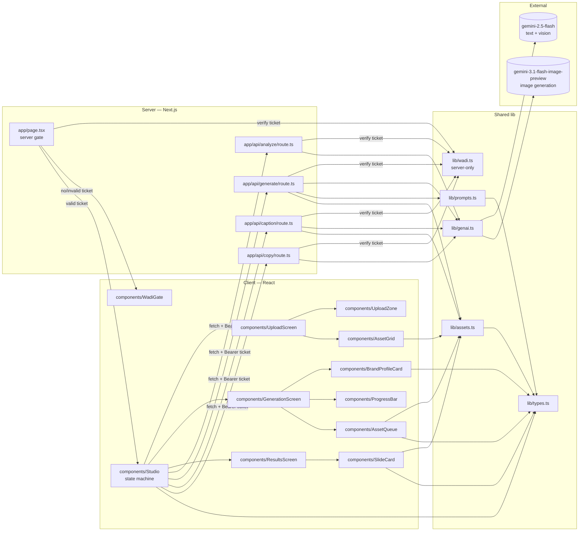

# BrandVista AI — Code Review Graph

A structured view of every module, what it depends on, what touches it, and the
order in which a reviewer should walk the code. Use it as the guided tour for
PR reviews.

---

## 1. Module dependency graph



**Access gate:** `app/page.tsx` is a server component. It verifies the Wadi
ticket (`?wadi_ticket=`) via `lib/wadi.ts` and renders either `WadiGate`
(refused) or `Studio` (the tool). Every `/api/*` route re-verifies the ticket
from the `Authorization: Bearer` header — that re-check is the real enforcement
boundary; the page gate is UX + defense-in-depth.

Read top-to-bottom. Anything pointing into a node is an inbound dependency; the
arrow tail is the consumer.

---

## 2. Runtime data flow (one analyze + generation cycle)

```mermaid
sequenceDiagram
  participant W as Wadi
  participant Pg as app/page.tsx (server gate)
  participant P as Studio (client)
  participant A as /api/analyze
  participant G as /api/generate
  participant Cap as /api/caption
  participant Cpy as /api/copy
  participant GF as gemini-2.5-flash
  participant GI as gemini-3.1-flash-image-preview

  W->>Pg: open /?wadi_ticket=<RS256 JWT>
  Pg->>Pg: verifyTicket() — no/invalid → WadiGate, stop
  Pg-->>P: render Studio(ticket)
  Note over P,Cpy: every /api/* call carries Authorization: Bearer <ticket>;<br/>each route re-verifies it (401 if absent/expired/forged)
  P->>A: POST multipart(logo) + Bearer ticket
  A->>GF: generateContent(image + JSON prompt)
  GF-->>A: brand profile JSON
  A-->>P: { profile, logoBase64, logoMimeType }

  par copy track (parallel)
    P->>Cpy: POST { brandProfile, logo }
    Cpy->>GF: generateContent(image + editorial JSON prompt)
    GF-->>Cpy: sparse CopyContent
    Cpy-->>P: { content }
  and image track (sequential per asset)
    loop for each selected asset
      P->>G: POST { assetType, brandProfile, logo }
      G->>GI: generateContent(logo + prompt, aspectRatio)
      GI-->>G: imageBytes (base64)
      G-->>P: { imageBase64 }
      P->>Cap: POST { assetType, brandProfile }
      Cap->>GF: generateContent(register-rotated prompt)
      GF-->>Cap: short editorial fragment
      Cap-->>P: { description }
      P->>P: mark job done
    end
  end

  P->>P: render ResultsScreen (slide deck)
```

The image loop is sequential — `gemini-3.1-flash-image-preview` has tight rate
limits and parallelism gives no real wall-clock benefit. Copy runs in parallel
with the entire image loop (single call), so it lands as soon as it's ready
and the slide deck swaps skeleton blocks for real copy live.

---

## 3. File map and responsibilities

| File | Layer | Responsibility | Key deps |
|------|-------|----------------|----------|
| `app/layout.tsx` | client | HTML shell, fonts | — |
| `app/page.tsx` | **server** | Wadi access gate. Reads `?wadi_ticket`, `verifyTicket()`; renders `WadiGate` (refused) or `Studio` (passes the raw ticket down). `export const dynamic = 'force-dynamic'`. | `lib/wadi`, `Studio`, `WadiGate` |
| `components/Studio.tsx` | client | Phase state machine (`upload → analyzing → results`); orchestrates analyze + parallel (copy ∥ image loop) + per-asset caption; cancellation via `cancelled` ref. Holds the ticket in state (so `FrameBridge` can refresh it); `authedFetch` attaches `Authorization: Bearer <ticket>` to every `/api/*` call. Props: `ticket`, `wadiOrigin`, `userId`, `plan`. Mounts `FrameBridge`. | `components/*`, `lib/types` |
| `components/WadiGate.tsx` | client | "Please open this from Wadi" refusal screen — exposes no tool functionality. Styled minimally (Wadi tokens applied in Checkpoint D). | — |
| `components/FrameBridge.tsx` | client | Embedded-mode glue (renders nothing). Posts `{type:'wadi:resize',height}` to the parent via `ResizeObserver`; strips `wadi_ticket` from the URL once embedded; accepts `{type:'wadi:ticket',token}` to refresh the in-memory ticket (origin-checked in prod). | — |
| `next.config.js` | server cfg | `headers()` sets `Content-Security-Policy: frame-ancestors 'self' $WADI_ORIGIN` (+ `localhost:*` in dev) — only Wadi may embed. Also `nosniff`, `Referrer-Policy`. No `X-Frame-Options`. | — |
| `app/globals.css` | client | Design tokens + component classes | tailwind |
| `components/UploadScreen.tsx` | client | Hero, upload zone, asset grid, validate-and-start. Copy is editorial ("Begin with the mark.", "The mark", "The world", "Begin") — no marketing language about "AI" or "mockups". | `UploadZone`, `AssetGrid` |
| `components/UploadZone.tsx` | client | Drag/drop + click-to-browse | — |
| `components/AssetGrid.tsx` | client | Render asset cards; multi-select | `lib/assets` |
| `components/GenerationScreen.tsx` | client | Brand profile + progress + queue layout. "Reading the mark…" placeholder while analyzing. | `BrandProfileCard`, `ProgressBar`, `AssetQueue` |
| `components/BrandProfileCard.tsx` | client | Render style/tone/env/lighting/materials + palette swatches | `lib/types` |
| `components/ProgressBar.tsx` | client | Gold-fill progress bar | — |
| `components/AssetQueue.tsx` | client | Per-asset row with status label + color. Labels are atmospheric (`Waiting`, `Rendering…`, `Inscribing…`, `✓`) not transactional. | `lib/assets`, `lib/types` |
| `components/ResultsScreen.tsx` | client | Slide-deck shell: carousel, keyboard nav, thumbnail strip, `window.print()` export via portal | `SlideCard`, `lib/types` |
| `components/SlideCard.tsx` | client | Renders every slide kind (`cover`, `atmosphere`, `logoObjective`, `mark`, `strategicIntent`, `safeZone`, `primaryColor`, `palette`, `displayFont`, `bodyFont`, `pattern`, `interlude`, `assetApplication`, `closing`). `atmosphere`/`mark`/`interlude` are silent pause slides (no copy). `assetApplication` picks one of 3 layout variants by deterministic `assetVariant(type)` hash. `TwoPanel` accepts a `split` prop and `LogoCenter` accepts `align`/`scale`/`background` for per-slide composition variance. Includes WCAG contrast helpers and `MonogramWatermark` (used by `strategicIntent` so the logo "disappears" into a tonal seal). **BOX-reference structural contract:** dense system pages (`logoObjective`, `strategicIntent`, `safeZone`, `primaryColor`, `palette`, `pattern`) are unified to `split="25% 75%"` (narrow rationale, vast artifact field). Color slides treat color as material — full-bleed bands with tone-on-tone serif-caps captions at bottom-left (opacity 0.85), never swatch chips with hex chrome. Type specimens (`displayFont`, `bodyFont`) use the `TypeSpecimenCredit` device (tiny tracked sans-caps label + horizontal rule) on a sand ground, no header chip. Pattern fills the right 75% on sand at large scale (120px tile) with a column-flute graphic on the far-right edge. | `lib/types`, `lib/assets` |
| `app/api/analyze/route.ts` | server | Multipart → base64 → `gemini-2.5-flash` (vision) → strip fences → parse `BrandProfile` JSON → return `{ profile, logoBase64, logoMimeType }` | `lib/genai` |
| `app/api/generate/route.ts` | server | Build per-asset prompt, call `gemini-3.1-flash-image-preview` with logo as `inlineData` and the right aspect ratio; model integrates the logo natively into the scene. Returns base64 PNG. | `lib/genai`, `lib/prompts`, `lib/assets` |
| `app/api/caption/route.ts` | server | One-line editorial caption per asset via `gemini-2.5-flash`. Picks a register (`fragment` / `sensory` / `place` / `material`) deterministically from `assetType` hash so the deck has rhythmic variety. Forbidden-words list enforces restraint. | `lib/genai`, `lib/assets` |
| `app/api/copy/route.ts` | server | Brand book `CopyContent` JSON via `gemini-2.5-flash` (logo passed as `inlineData`). Hard word caps per field; prohibits the "[object] embodies [concept] through [feature]" formula. | `lib/genai` |
| `lib/types.ts` | shared | `AssetType` (11 entries), `SYSTEM_ASSET_TYPES`, `isSystemAsset`, `BrandProfile`, `AssetJob`, `AssetStatus` (`queued|generating|captioning|done|error`), `CopyContent` (sparse fragment shape), `ColorEntry`, `StrategicPillar` | — |
| `lib/assets.ts` | shared | Asset metadata: label, aspect ratio. `zone: {x,y,w,h}` is **legacy/dead** — left in the shape but no longer read (compositing was removed). | `lib/types` |
| `lib/prompts.ts` | shared | `buildPrompt(assetType, brand)` — one switch arm per asset describing how the logo should be natively integrated (embroidered, foil-stamped, letterpressed, etc). Prompt voice is **editorial / architectural / atmospheric** — single sensory anchor, generous negative space, no commercial product-shot framing. The `SUFFIX` negative list rejects bokeh, hero-shot lighting, busy compositions, generic stock feel. `pick()` provides safe fallbacks for empty profile arrays. | `lib/types` |
| `lib/genai.ts` | server-only | Lazy-initialized `GoogleGenAI` client; throws if `GEMINI_API_KEY` is missing. (Replaced by the Wadi AI proxy in Checkpoint C.) | `@google/genai` |
| `lib/wadi.ts` | server-only | Verify Wadi RS256 tickets via `WADI_JWT_PUBLIC_KEY` (pins `algorithms:['RS256']`, checks `iss`/`aud`/`exp`, fails closed). `verifyTicket`, `ticketFromRequest`, `getRequestTicket`. | `jose` |

**All four `/api/*` routes** call `getRequestTicket(req)` as their first step
and return `401` if the ticket is absent, expired, or forged — this is the
server-side enforcement boundary. Dev/test tickets: `scripts/mint-ticket.mjs`
(`npm run ticket`).

---

## 4. Suggested review order

Walk the code in this order — each step's context is set up by the prior one.

1. **`lib/types.ts`** — vocabulary. `AssetType` union, `BrandProfile`,
   `CopyContent` (intentionally sparse), `AssetStatus` (note `captioning`).
2. **`lib/assets.ts`** — the asset registry. Adding a 12th asset means a row
   here plus a `case` in `lib/prompts.ts` and a literal in the `AssetType`
   union. The `zone` field is legacy; do not rely on it.
3. **`lib/prompts.ts`** — the per-asset prompt switch. Each arm tells the
   image model *how* the logo is physically integrated (embroidery, foil,
   letterpress, screen print). The `SUFFIX` forbids "sticker" placement —
   that's the model's failure mode.
4. **`lib/genai.ts`** — singleton client. The only place `GEMINI_API_KEY` is
   read.
5. **`app/api/analyze/route.ts`** — verify `stripJsonFences` covers ```json
   fences and bare `{…}` extraction. The error path returns the raw text so
   a malformed response is debuggable.
6. **`app/api/generate/route.ts`** — confirm aspect ratio comes from
   `getAsset(...)`, that `responseModalities: ['IMAGE']` is set, and that
   the response shape walk (`candidates[0].content.parts[].inlineData.data`)
   is defensive.
7. **`app/api/caption/route.ts`** — verify the **register rotation** is
   deterministic (same `assetType` always picks the same register so the
   deck's voice is stable across re-runs of the same selection). Confirm
   the forbidden-words list is intact — if those leak back in, the deck
   stops feeling editorial.
8. **`app/api/copy/route.ts`** — verify the word caps in the JSON template
   and the explicit anti-pattern prohibition. The prompt is the contract;
   relaxing it instantly degrades voice.
9. **`app/page.tsx`** — the state machine. Three invariants:
   - image generation is **sequential** (`for…of`, not `Promise.all`)
   - copy is fetched **in parallel** with the image loop via `Promise.all`
   - `cancelled` ref short-circuits both tracks on Back/Restart
10. **`components/UploadScreen.tsx` → `UploadZone` → `AssetGrid`** — input
    side. Confirm the start gate requires a file + ≥1 asset.
11. **`components/GenerationScreen.tsx` → `BrandProfileCard`, `ProgressBar`,
    `AssetQueue`** — confirm progress counts only `done`, and queue colors
    map all five statuses including `captioning`.
12. **`components/ResultsScreen.tsx`** — the slide-deck shell. Verify
    keyboard nav (← / →), the print portal (mounts every slide to
    `document.body` so `window.print()` produces the full PDF), and that
    the `slides` memo includes copy fields conditionally (slide kinds
    receive `content?:` so they render skeleton states while copy is in
    flight).
13. **`components/SlideCard.tsx`** — per-slide composition. Check that no
    slide reintroduces explanatory bullet lists or labeled "X:" headers —
    the deck's voice depends on visual restraint matching the copy
    restraint. Verify pause slides (`atmosphere`, `mark`, `interlude`)
    stay silent, that dense system slides hold the BOX-reference
    `split="25% 75%"` (narrow rationale, vast artifact field) rather
    than drifting back to wider rationale columns, and that the three
    `assetApplication` variants picked by `assetVariant()` all still
    render correctly.
14. **`app/globals.css`** — last. Tokens (gold `#C9A84C`, sand `#F5F0E8`)
    match the design system.

---

## 5. Hot spots — what reviewers should scrutinize

| Concern | Where | Why it matters |
|---------|-------|----------------|
| Wadi access gate | `lib/wadi.ts`, `app/page.tsx`, all `/api/*` | The whole paywall depends on this. `jwtVerify` MUST stay pinned to `algorithms:['RS256']` (prevents `alg:none` and HS256-confusion forgery). Every API route must verify independently — the page gate alone is bypassable by calling the API directly. `verifyTicket` fails closed (returns null on any error, incl. missing key). Never log the raw ticket. |
| Editorial voice contract (copy) | `app/api/copy/route.ts`, `app/api/caption/route.ts` | The deck's "luxury, human-directed" feel lives in these prompts. The forbidden-words list and word caps are the contract — they have already been tuned to suppress the "[object] embodies [concept] through [feature]" failure mode. Loosening them regresses the whole product. |
| Editorial voice contract (image prompts) | `lib/prompts.ts` `bodyFor()` + `SUFFIX` | The image model's natural failure mode is commercial product photography ("hero shot, 3/4 angle, bokeh"). The prompts were rewritten to editorial/architectural language with a single sensory anchor per asset, and the `SUFFIX` explicitly bans the failure mode vocabulary. Reverting to product-shot language regresses imagery to stock-luxury aesthetic. |
| Caption register rotation | `app/api/caption/route.ts` `pickRegister()` | Determinism is intentional: same asset → same register, so a deck of 4 captions stays varied without per-call state. If you switch to random selection, captions can drift to a single register on a given run. |
| JSON parsing brittleness | `app/api/analyze/route.ts`, `app/api/copy/route.ts` `stripJsonFences` | Same helper duplicated in two routes. Models occasionally add preamble or trailing prose; the brace-extract fallback covers it. |
| Rate limits | `app/page.tsx` image loop | Sequential by design. Parallelizing image generation will tip the model into 429s on most projects. Copy runs *in parallel with the loop as a whole*, but that's a single extra call — safe. |
| Cancellation correctness | `app/page.tsx` `cancelled` ref | Without it, hitting Back mid-run can resurrect old responses and clobber a fresh run. Reset to `false` at the top of `handleStart`. Both tracks (`fetchCopy` and `runImagePipeline`) check it. |
| Logo integration realism | `lib/prompts.ts` `SUFFIX` | The image model's failure mode is "logo as sticker on top of the scene." The `Avoid: ...` suffix is the only thing preventing that. Don't remove it. |
| Memory footprint | All API routes | Base64 images move through JSON bodies. Fine for a single user; if you ever batch, switch to streaming or temp files. |
| API key exposure | `lib/genai.ts` | Server-only import. Never import from a client component. Lazy singleton avoids touching `process.env` at module load time on the client build. Env var is `GEMINI_API_KEY` (not `GOOGLE_API_KEY`). |
| Asset registry drift | `lib/assets.ts` ↔ `lib/prompts.ts` ↔ `lib/types.ts` `AssetType` | Adding an `AssetType` requires all three: union literal, `ASSETS` row, and a `case` in `buildPrompt`. TypeScript's exhaustive switch surfaces missing cases as a `string | undefined` return at the call site. |
| Slide voice drift | `components/SlideCard.tsx` | The slides are intentionally lean — no "Objective:" / "Usage:" labels, no bullet lists. Reintroducing them re-creates the corporate-deck feel even with good copy. |
| Pacing / pause slides | `components/SlideCard.tsx` `AtmosphereSlide`/`MarkSlide`/`InterludeSlide`, sequence in `ResultsScreen.tsx` | The deck's cinematic feel depends on silent slides interleaved with dense ones (`cover → atmosphere → logoObjective → mark → strategicIntent`, then `pattern → interlude → assets`). Removing these or making them carry copy collapses the rhythm. |
| Composition variance | `TwoPanel` `split`, `LogoCenter` `align`/`scale`, `assetVariant()` | Dense system pages use the BOX-reference `25% 75%` (see the BOX-reference structural contract row). Variance lives in `LogoCenter` placement (`center` / `lower-right` / `upper-left`) and in the 3 `assetApplication` layout variants picked deterministically by `assetVariant()`. Hard-coding a single asset-variant or restoring uniform 40/60 across system pages removes the "art-directed" feel. |
| Tool-brand leakage | `CoverSlide`, `ClosingSlide` | These slides must not name "BrandVista AI" or any internal tool — the deck is presented as the brand's own artifact. Footer slots use neutral labels (`Brand Identity`, `End`). |
| BOX-reference structural contract | `components/SlideCard.tsx` — `TwoPanel` `split="25% 75%"` on all dense system pages (`LogoObjectiveSlide`, `StrategicIntentSlide`, `SafeZoneSlide`, `PrimaryColorSlide`, `PaletteSlide`, `PatternSlide`); `TypeSpecimenCredit` helper (label-with-rule device) used by `DisplayFontSlide` and `BodyFontSlide`; tone-on-tone serif-caps captions in `ColorPanel` and `ColorStrip` (opacity 0.85, no swatch chrome) | These three moves are what separates the deck from generic AI-template feel. Drifting back to wider rationale columns (40/60, 45/55, 50/50) re-centers the page on the explanatory copy rather than the artifact, killing the editorial composition. Reintroducing swatch-chip + hex-label rows on `PaletteSlide` or rationale chrome over color floods on `PrimaryColorSlide` collapses "color as material" back to "color as specification." Removing the `TypeSpecimenCredit` rule device on the type specimens makes them read as bare hero text rather than as labelled brand-book specimens. |

---

## 6. Boundaries

- **Client → Server:** only via `fetch('/api/...')`. No server imports leak
  into client components.
- **Server-only modules:** `lib/genai.ts`, `lib/wadi.ts` (marked
  `import 'server-only'`), all `app/api/*`. `lib/wadi.ts` is imported by the
  server component `app/page.tsx` and by the API routes — never by a client
  component.
- **Access boundary:** unauthenticated requests get the `WadiGate` (page) or a
  `401` (API). The raw ticket flows server→`Studio` as a prop and back up only
  in the `Authorization` header — it is never persisted or logged.
- **Shared modules:** `lib/types.ts`, `lib/assets.ts`, `lib/prompts.ts` are
  pure (no I/O, no `fetch`, no `process.env`) and safe on either side.
- **No persistence:** nothing writes to disk or a database. Logos and
  generated images live in component state and request bodies only.

---

## 7. What a future change should look like

- **Add an asset:** `lib/types.ts` (union literal) + `lib/assets.ts` (row in
  `ASSETS`) + `lib/prompts.ts` (`case`). Nothing else. If the asset is a
  "system" slide (pattern / social / poster), also add it to
  `SYSTEM_ASSET_TYPES`.
- **Swap models:** change the model ID in the relevant route. The SDK is
  unified. If swapping the image model, re-test the logo-integration
  prompt against the new model — failure modes differ.
- **Add a slide kind:** add the variant to the `Slide` union in
  `SlideCard.tsx`, write the renderer function, add the case in
  `SlideCard`'s switch, then add the entry to the `slides` memo in
  `ResultsScreen.tsx`. If the slide needs LLM-generated copy, also add
  the field to `CopyContent` in `lib/types.ts` and the JSON template in
  `app/api/copy/route.ts`. Consider whether the new slide is dense (needs
  a pause slide before/after) or silent (already a pause).
- **Change the design system:** tokens in `app/globals.css` and
  `tailwind.config.ts`. Components reference token classes, not raw hexes.
- **Tune the voice:** edit the prompts in `app/api/copy/route.ts` and/or
  `app/api/caption/route.ts`. Treat the forbidden-words list and the
  per-field word caps as part of the product spec, not implementation
  detail.
